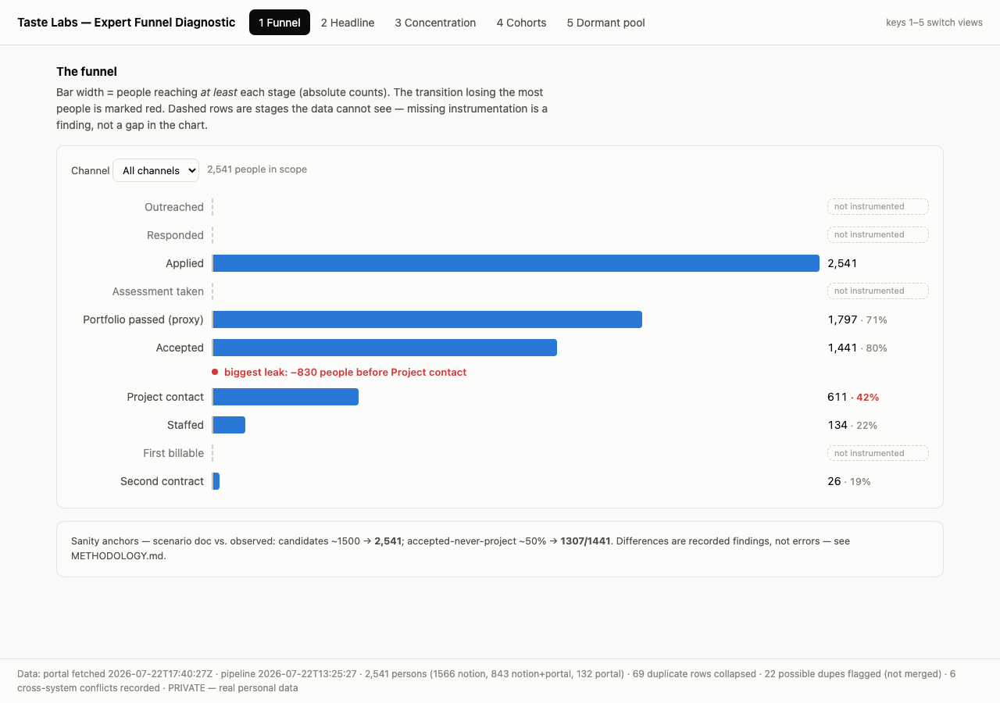

# taste-wt-dashboard

Expert funnel diagnostic for the Taste Labs work trial: a Python pipeline turns raw exports
(Notion application DB + taste-portal API) into one cleaned person-level spine, and a
dependency-free dashboard renders the diagnosis.



## Run it (3 commands)

```
make setup     # one-time: python venv + deps
make refresh   # raw exports -> data/processed/*.json  (rerun when new data lands)
make dev       # dashboard at http://127.0.0.1:8471/app/  (also: npm run dev)
```

Keys **1–5** switch views when presenting.

## What each view answers

| # | View | Question it answers |
|---|---|---|
| 1 | Funnel | Where do people fall out, in absolute heads? (biggest leak auto-marked red; unmeasurable stages shown as "not instrumented" — a finding, not a blank) |
| 2 | Headline | The five numbers: vetted-never-staffed, its cost (editable $/designer), activation rate (VAR proxy), median time-to-staffed, repeat contracts |
| 3 | Concentration | Who is actually working? (billable hours not instrumented — view shows the proxies and says so) |
| 4 | Cohorts | Is the funnel getting better or worse by application month? |
| 5 | Dormant pool | The 1,307 vetted-never-staffed, split "never offered" vs "offered, not converted" |

## Layout

- `pipeline/` — `mapping.yml` (editable canonical mapping) + ingest → clean → metrics; every
  decision printed and logged. **`METHODOLOGY.md` is the companion deliverable.**
- `app/` — static dashboard (no build step); renders `data/processed/metrics.json` only.
- `deliverables/` — one doc per presentation objective (friction, north star, roadmap,
  activation, gaps) + the data-mapping spec.
- `data/raw/`, `data/processed/`, `.env` — **gitignored; real data never leaves this machine.**
  There is also a raw-data explorer at `data/raw/funnel.explorer.html` (generated by
  `scripts/build_explorer.py`) for row-level browsing.

Committed files carry aggregate counts only — no personal data.
